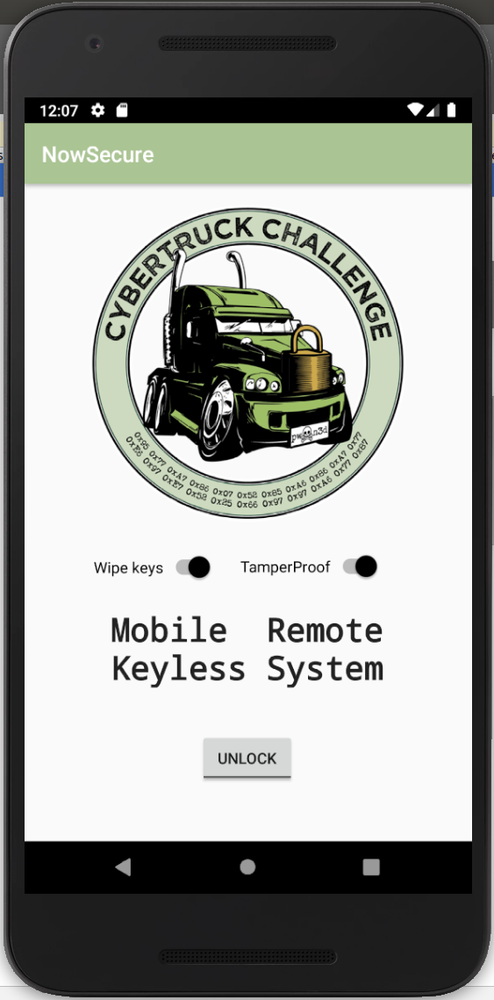

# CyberTruckChallenge19

Android security workshop taught at the CyberTruck Challenge 2019 (Detroit USA). Further info at https://www.cybertruckchallenge.org

## Description

A new mobile remote keyless system "CyberTruck" has been implemented by one of the most well-known car security companies "NowSecure Mobile Vehicles". The car security company has ensured that the system is entirely uncrackable and therefore attackers will not be able to recover secrets within the mobile application.

If you are an experienced Android reverser, then enable the `tamperproof` button to harden the application before unlocking your cars. Your goal will consist on recovering up to 6 secrets in the application.

## Material

The content is provided in folders such as:
- `slides`: Presentation during the Android workshop (1h)
- `apk`: Final Android crackme APK which can unlock up to 3 vehicles.
- `src`: Source code of the crackme
- `notes`: Additional notes, troubleshooting, and so on
- `solutions`: Possible solutions to the crackme (x86 and Aarch64)
- `student`: JS code provided as template to write your Frida hooks
- `img:`: Screenshots of the crackme running on the Android emulator

## Mobile CTF: Android Crackme

It is required to have an Android device either emulated or physical. During the workshop we employed an AVD Google Pixel 2XL running Android 9.0 that it can be obtained for free with Android Studio. Additionally, the tamperproof check needs to have the Frida server binary placed in `/data/local/tmp/frida-server`.

### Challenge1 to unlock car1. "DES key: Completely Keyless. Completely safe"

- `50pts`: There is a secret used to create a DES key. Can you tell me which one?

- `100pts`: There is a token generated at runtime to unlock the carid=1. Can you get it? (flag must be summitted in hexa all lowercase)

### Challenge2 to unlock car2: "AES key: Your Cell Mobile Is Your Key"

- `50pts`: This challenge has been obfuscated with ProGuard, therefore you will not recover the AES key.

- `100pts`: There is a token generated at runtime to unlock the carid=2. Can you get it? (flag must be summitted in hexa all lowercase)

###  Challenge3 to unlock car3. "Mr Truck: Unlock me Baby!"

- `50pts`: There is an interesting string in the native code. Can you catch it?

- `100pts`: Get the secret generated at runtime to unlock the carid=3. Security by obscurity is not a great design. Use real crypto! (hint: check the length when summitting the secret!)

### Contact

Eduardo Novella <enovella@nowsecure.com>

### Public Write-ups

- [verso.se](https://www.verso.re/posts/cybertruck/) (by Joan Calabrés)

